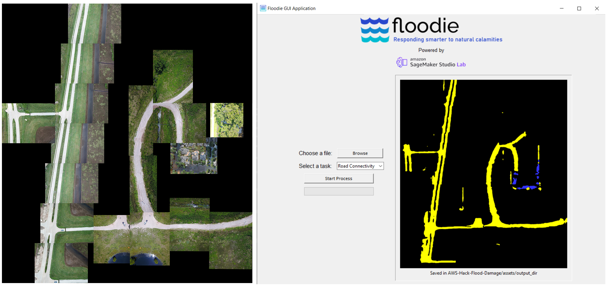

# AWS-Hack-Flood-Damage
## About
This project was made for AWS Disaster Response Hackathon. This repository contains code for identifying damaged regions in an aerial image. Identifying damaged objects (such as roads and buildings) in aerial images can be helpful to disaster-response organizations in responding to natural calamities faster and more efficiently. This project focuses on how organizations can respond better to damage inflicted by hurricanes and floods. The datasets used to train models contain aerial images of zones affected by hurricane Harvey.

## Functionality
The project is focused on the response phase of a disaster life cycle. It provides two basic functions. 
* **Road Connectivity: *Identify flooded and non-flooded roads.*** This can be useful for various tasks (transportation and mobility) such as planning a route to a particular location when some roads are inundated with water. It gives a basic overview of connectivity of roads which flooded and non-flooded. 
* **Damaged Regions: *Identify damaaged regions (broken houses or flooded parts).*** This can be useful to organization in estimating which areas in a town or city have been affected the most, thereby allowing them to properly direct their efforts. 
* **Basic Graphical User Interface.**</b> This allows users to upload their aerial images (from UAV or Satellite) and easily implement the above mentioned functions. The GUI application was made with the Tkinter module in python. More features can be added to the GUI implemented in the future. The image below is the starting screen of the app. 

  

## Dependencies 
The project relies on the following dependencies. Make sure all of the packages mentioned below are installed.
1. [TensorFlow](https://www.tensorflow.org/)
2. [Numpy](https://numpy.org/) 
3. [Pillow (PIL)](https://pillow.readthedocs.io/en/stable/)
4. [Tkinter](https://docs.python.org/3/library/tkinter.html)
5. [Tqdm](https://github.com/tqdm/tqdm)

## Models
Weights of trained models are stored in `AWS-Hack-Flood-Damage/models/`. They can be loaded into a model by implementing `load_weights()` method of `tensorflow.keras.Model` class.
| Sl. no. | Name | Description | Architecture | Task Type | Dataset | 
| --- | --- | --- | --- | --- | --- |
| 1. | **U-NET-like model.** | Used for segmentation done on aerial images to identify flooded and non-flooded roads | Similar to U-Net architecture. See [here](https://github.com/hamdaan19/AWS-Hack-Flood-Damage/blob/main/scripts/unet_xception_model.py) for more details. | Semantic Segmentation | [FloodNet dataset](https://github.com/BinaLab/FloodNet-Challenge-EARTHVISION2021) | 
| 2. | **Xception model.** | Used for binary classification of 128x128 sized images as damaged or not damaged. | It uses the same architecture of Xception but with the last layer substituted with a FC layer of 2 neurons with a softmax activation. | Binary Classification | [Hurricane Damage dataset](https://www.kaggle.com/kmader/satellite-images-of-hurricane-damage) |

## Usage & Instructions 
1. Git clone the repository on your local machine. 
2. Change directory to to `Your-Folder-Path/AWS-Hack-Flood-Damage/scripts/tkinter_gui/` and run `app.py`.
3. A new window will appear as shown in the image above. Click on the ***Browse*** button and choose a file. 
4. Select the task you want to perform on the image: *Road connectivity* or *Damaged Regions*.
5. Click on the ***Start Process*** button to begin the process and wait till you image gets loaded in the application. You can also observe the progress of the task in the terminal window. 

The images below show a sample of both tasks after being performed on two images. The images chosen can be of any size and resolution. 

  

<small>Yellow represents Non-Flooded roads and Blue represents Flooded roads (although blue cannot be seen in this image).</small>

  

<small>Green represents Non-Damaged regions and Red represents Damaged regions.</small>

## Datasets
1. [FloodNet Dataset](https://github.com/BinaLab/FloodNet-Challenge-EARTHVISION2021). > The data is collected with a small UAS platform, DJI Mavic Pro quadcopters, after Hurricane Harvey. The whole dataset has 2343 images, divided into training (~60%), validation (~20%), and test (~20%) sets.
